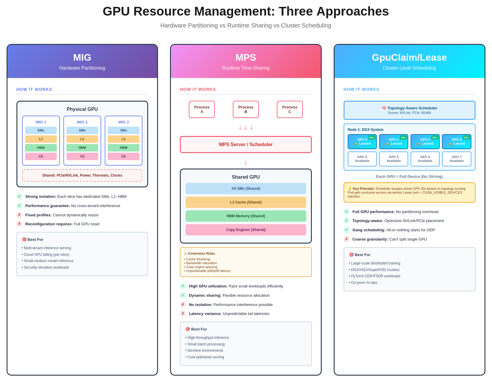

# GPU Scheduler

Topology-aware, gang-friendly GPU scheduler for Kubernetes with atomic device leasing, claim-based APIs, and automatic environment injection.




## Features

- **Smart GPU Allocation**: Atomic device locking prevents double-booking
- **Topology Awareness**: Prefers GPUs with fast interconnects (NVLink)
- **Declarative API**: Define GPU needs with `GpuClaim` resources
- **Automatic Setup**: Webhook injects `CUDA_VISIBLE_DEVICES` automatically
- **Gang Scheduling**: Multi-pod coordination (planned)


## Quick Start

```bash
# 1. Install
helm install gpu-scheduler charts/gpu-scheduler -n gpu-scheduler

# 2. Create a GPU claim
kubectl apply -f - <<EOF
apiVersion: gpu.scheduling/v1
kind: GpuClaim
metadata:
  name: single-gpu
spec:
  devices:
    count: 1
    exclusivity: Exclusive
EOF

# 3. Run a pod
kubectl apply -f - <<'EOF'
apiVersion: v1
kind: Pod
metadata:
  name: gpu-test
  namespace: gpu-scheduler
  annotations:
    gpu.scheduling/claim: single-gpu
spec:
  schedulerName: gpu-scheduler
  restartPolicy: Never
  containers:
    - name: cuda-test
      image: nvidia/cuda:12.4.1-runtime-ubuntu22.04
      command: ["bash","-lc","echo CVD=$CUDA_VISIBLE_DEVICES; nvidia-smi -L && nvidia-smi --query-gpu=index,name,memory.total --format=csv"]
      resources:
        limits:
          nvidia.com/gpu: "1"
EOF

# 4. Check results
kubectl get gclaim -n gpu-scheduler
NAME         AGE
single-gpu   26m


kubectl get gns -n gpu-scheduler -o wide
NAME        AGE
aaron-lgt   20m

k logs gpu-test -n gpu-scheduler
CVD=0
GPU 0: NVIDIA GeForce RTX 5080 (UUID: GPU-7fb26e77-c956-a86e-2e85-a51d8abbb7c5)
index, name, memory.total [MiB]
0, NVIDIA GeForce RTX 5080, 16303 MiB
```

## Compatibility Targets

- **Kubernetes**: Built and validated against 1.33.x (active support until mid‑2026). Smoke tests still run against 1.32/1.31, but older clusters are best-effort only.
- **Go toolchain**: Requires Go 1.24.x to compile all components. Earlier releases are unsupported because the Kubernetes 1.33 libraries demand Go 1.24 or newer.

## Documentation

- **[Architecture](docs/architecture.md)** - How the system works under the hood
- **[Usage Guide](docs/usage.md)** - Installation, examples, and troubleshooting
- **[Webhook Certificates](docs/webhook-certificates.md)** - TLS certificate setup for admission webhook
- **[RBAC Configuration](docs/rbac.md)** - ServiceAccount and permissions setup
- **[Development Guide](docs/development.md)** - Building, testing, and contributing
- **[API Reference](docs/api-reference.md)** - Complete API documentation

## How It Works

The system has three components working together:

```
┌─────────────┐      ┌─────────────┐      ┌─────────────┐
│  Scheduler  │      │   Webhook   │      │    Agent    │
│   (Plugin)  │      │  (Mutator)  │      │ (DaemonSet) │
└──────┬──────┘      └──────┬──────┘      └──────┬──────┘
       │                    │                    │
       └────────────────────┴────────────────────┘
                           │
                  Kubernetes API Server
```

1. **Scheduler**: Allocates GPUs using atomic lease-based locking
2. **Webhook**: Injects `CUDA_VISIBLE_DEVICES` environment variable
3. **Agent**: Reports GPU inventory and topology from each node

**Key Innovation**: Uses Kubernetes Coordination Leases for atomic GPU allocation - preventing race conditions and double-booking.

See [Architecture](docs/architecture.md) for detailed explanation.

## Building

```bash
# Build scheduler
make docker

# Build webhook
make docker-webhook

# Build agent
make docker-agent
```

See [Development Guide](docs/development.md) for local development setup.

## Examples

### Single GPU

```yaml
apiVersion: gpu.scheduling/v1
kind: GpuClaim
metadata:
  name: single-gpu
spec:
  devices:
    count: 1
    exclusivity: Exclusive
```

### Multi-GPU with Topology

```yaml
apiVersion: gpu.scheduling/v1
kind: GpuClaim
metadata:
  name: training-gpus
spec:
  devices:
    count: 4
    policy: contiguous
    exclusivity: Exclusive
  topology:
    mode: Preferred
    minBandwidthGBps: 600
```

More examples in [Usage Guide](docs/usage.md).

## Current Status (MVP)

**Implemented**:
- ✅ GpuClaim and GpuNodeStatus CRDs
- ✅ Scheduler plugin with lease-based allocation
- ✅ Webhook for CUDA_VISIBLE_DEVICES injection
- ✅ Agent skeleton (reports placeholder data)
- ✅ Helm chart for deployment

**TODO**:
- ⏳ NVML integration in agent
- ⏳ Topology scoring in scheduler
- ⏳ Node selector enforcement
- ⏳ Gang scheduling support
- ⏳ Automatic lease cleanup
- ⏳ Fabric-aware scheduling (NVLink, InfiniBand/GPUDirect, cuFile). See [docs/todo.md](docs/todo.md) for the evolving plan.

## Contributing

See [Development Guide](docs/development.md).


## License

This project is licensed under the MIT License - see the [LICENSE](LICENSE) file for details.
